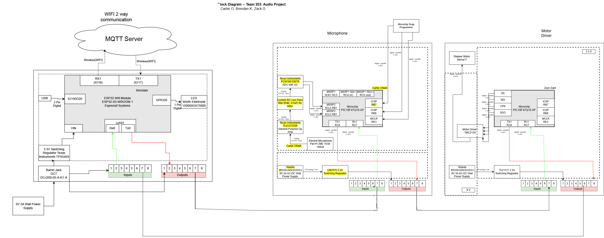

## Team Block Diagram

## Decision Making Process
Our final system is divided into three chunks — MQQT on the left, microphone input the middle, and motor on the right. The ESP32 listens to the audio input, passes the signal to the motor board, and the motor driver responds, while then sending the updated information to the MQQT server board.

Grouping by subsystem was kept clean and simple. Every major block is framed and labeled. You know what you're looking at right away. The color-coding supports visibility. Red lines for transmitting data, green for receiving. 

## Meeting Requirements

* Brendan’s ESP32 handles the internet/MQTT.

* Carter’s board captures and digitizes sound from a microphone for the input sensing.

* Zack’s microcontroller drives a stepper motor, his is the actuator.

* And each board has its own barrel jack, 3.3V switching regulator, and jumpers to handle power.

## In-Depth
Sensor Subsystem (Carter): I2C-based ADC (the PCM1861) reads data from the analog microphone, doing real-time audio with custom filtering.

Actuator Subsystem (Zack): Stepper motor. SPI communication with a TMC2130 driver.It's controllable in both directions, as the requirement calls for. 

Internet Communication (Brendan): The ESP32 connects to the MQTT server over WiFi and handles data publishing/subscribing. Sends duplex—sensor data out, control messages back in.