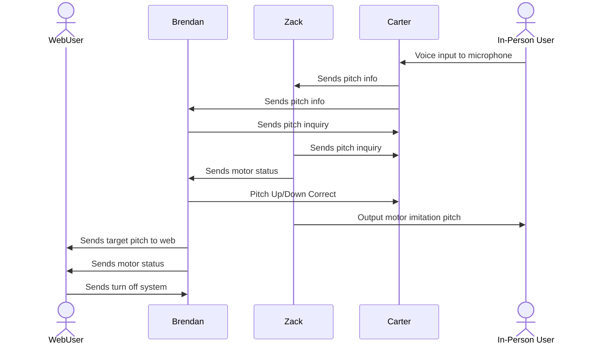

This communication process demonstrates real-time bidirectional interaction between the physical String Machine and the web interface. When the in-person user speaks into the microphone, Carter extracts the pitch (in Hz) and sends it to both Brendan and Zack. Zack uses this data to generate a physical response by adjusting the stepper motor to match the pitch’s corresponding wavelength. Brendan formats the detected pitch and waveform data into a visual representation and uploads it to the web for remote viewing. Meanwhile, the WebUser can interact with the system by sending a target pitch or correction (e.g., "target = 440 Hz"), which Brendan routes back to Carter and Zack to adjust processing logic and motor behavior accordingly. This two-way link enables synchronized physical and digital feedback, providing both remote and local users with a seamless educational experience.
