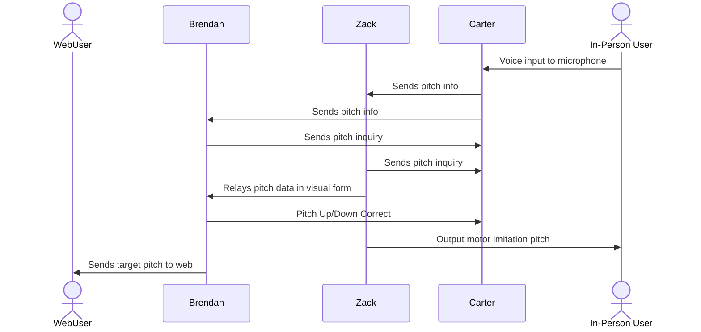

```mermaid

sequenceDiagram
    actor W as WebUser
    participant Brendan
    participant Zack
    participant Carter
  actor I as In-Person User
    
    I->>Carter: Voice input to microphone
    Carter->>Zack: Sends pitch info
    Carter->>Brendan: Sends pitch info
    Brendan ->> Carter: Sends pitch inquiry
    Zack->>Carter: Sends pitch inquiry
    Zack->>Brendan: Relays pitch data in visual form
    Brendan->>Carter: Pitch Up/Down Correct
    Zack->>I: Output motor imitation pitch

Brendan ->> W: Sends target pitch to web
``` 
