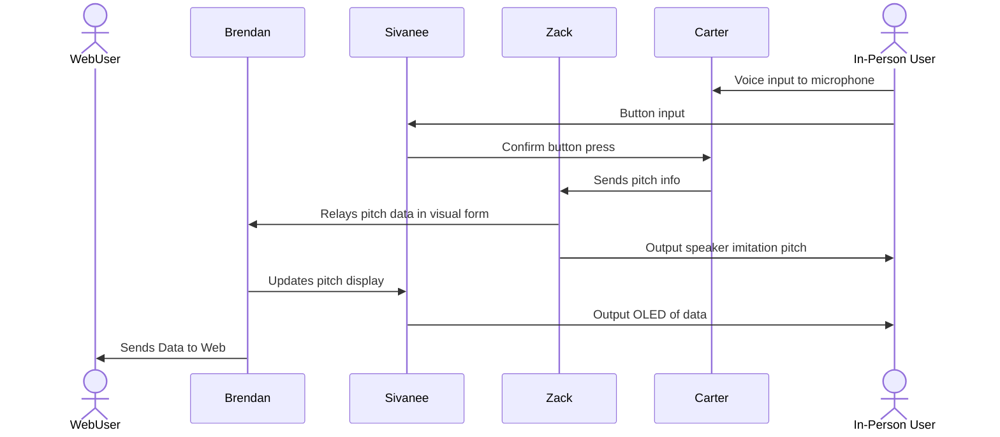

```mermaid

sequenceDiagram
    actor W as WebUser
    participant Brendan
    participant Sivanee
    participant Zack
    participant Carter
  actor I as In-Person User
    
    I->>Carter: Voice input to microphone
    I->>Sivanee: Button input
    Sivanee->>Carter: Confirm button press
    Carter->>Zack: Sends pitch info
    Zack->>Brendan: Relays pitch data in visual form
    Zack->>I: Output speaker imitation pitch
    Brendan->>Sivanee: Updates pitch display
    Sivanee->>I: Output OLED of data 
Brendan ->> W: Sends Data to Web
``` 
