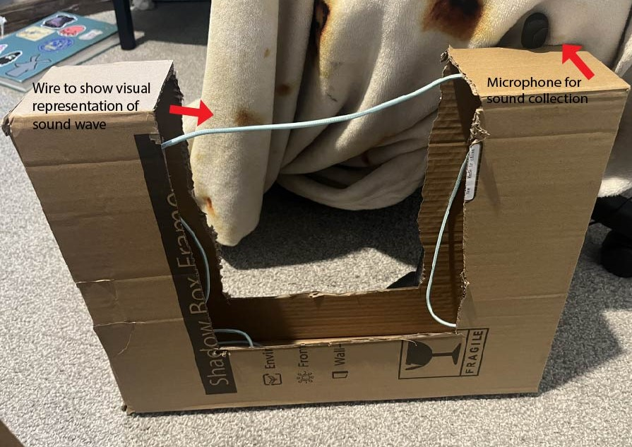

## Team Ideation and Concept Generation

### Goal of our exhibit:

For our teams project, our goal is to be able to demonstrate a concept. We want to be able to do something that allows people to see things that are either too small or not visible in a way that is physically observable. We have liked the ideas of things such as magnetic fields, the light spectrum, and sound waves, all of which are things that are always around us in daily life, however they are not seen or thought of much. We want our project to be something that is interactive as well. so it involves button pressed or sound recognition.

### Audience for our exhibit:

Our intended user for this project is K-12 students. We want to help them to be able to have a better understanding and interest in things such as science, technology, engineering, or math skills. The goal is for audience to not need to have a lot of previous knowledge on our subject as we want to create a project that can help teach both basics, but still be interesting to those with prior knowledge.

### Team brainstorm phases:

.png>)

.png>)

### Design concept:

[Similar project: String machine](<https://www.exploratorium.edu/snacks/string-machine>)

Our exhibit will be of the interactive type, encouraging visitors to control the input of a motor by varying speed via a microphone. This will demonstrate the causal relationship of tonality of sound to the output of a standing wave. Natural learning by association will take place due to the instant and comparative feedback. A loud low sound input into the microphone will produce a longer period wave with a taller amplitude wave on the string. 

We decided on our design for the project by narrowing down the ideas we had brainstormed and used that to 

Our goal for demonstration is to simply demonstrate the physical properties of waves based on sound input, or a preset input. Considering our audience is in the range of K-12, the interface for them to interact is via microphone or pushbutton. Children are born into this world with the gift of vocalization and use it judiciously to interact with the world around them, so this exhibit aims to let them connect their speech to the physical properties of waves. For those born mute, we include pushbuttons to generate specific frequencies to allow a reliable and fair type of interaction. The microphone will be secured in a bright visually appealing plastic container. The push buttons will be large and comfortable for child-hands. The device will be enclosed in a secure aluminum project box with rounded edges. All external device wiring will be enclosed in insulated wiring harness hose wrap, and physically secured to the display. The rotating portion will be set back far enough away from participants that they would have to jump into the display to become injured. 

A sample of potential audience members will be interviewed to discern their understanding of sound waves, what draws them to the topic, and what they do not understand. Misconceptions of wave physics can be addressed directly with small placards or notes providing more in-depth information. Furthermore, very obvious labeling will be added to the system to define the use of the pushbuttons, encourage the use of the microphone, define meaning of the string fluctuation, and explain the information presented via web interface. 

Functionality will be divided across the four teammates as follows:
 - Zach: Actuator Controlled Outputs
 - Carter: Sensor Controlled Inputs and Processing
 - Sivanee: Human Machine Interface via buttons and visual output screen
 - Brendan: Internet based two-way communication protocol. 

Presentation URL: 
<iframe width="560" height="315" src="https://www.youtube.com/embed/Tab7B2oGWzE?si=hOPViFCjGyavay8b" title="YouTube video player" frameborder="0" allow="accelerometer; autoplay; clipboard-write; encrypted-media; gyroscope; picture-in-picture; web-share" referrerpolicy="strict-origin-when-cross-origin" allowfullscreen></iframe>