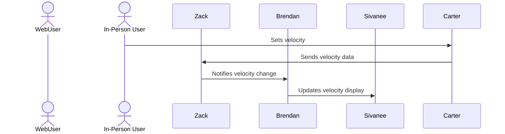

## Team Block

## Team Mermaid Diagram

```mermaid

sequenceDiagram
    actor W as WebUser
    actor I as In-Person User
    participant Zack
    participant Brendan
    participant Sivanee
    participant Carter
    
    I->>Carter: Sets velocity
    Carter->>Zack: Sends velocity data
    Zack->>Brendan: Notifies velocity change
    Brendan->>Sivanee: Updates velocity display
``` 

## Message Types
